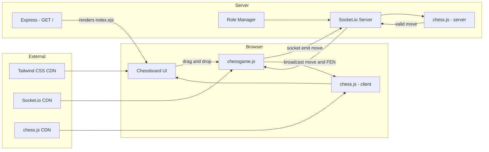
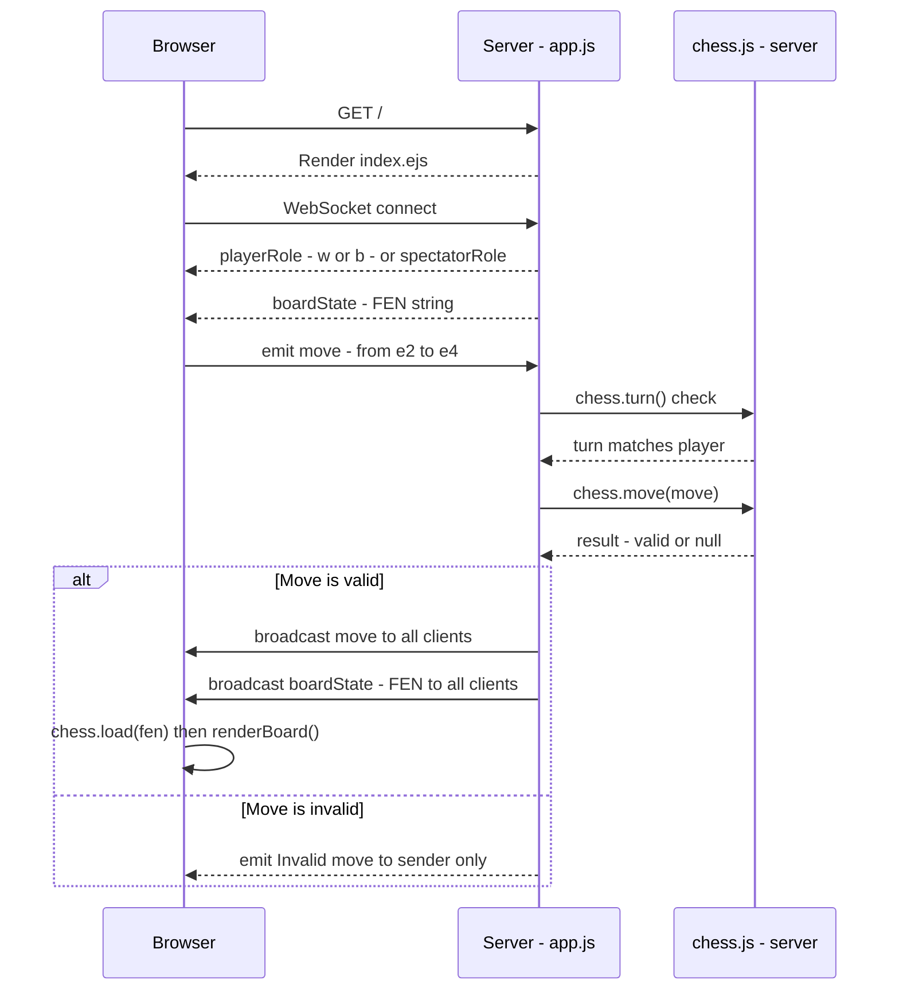
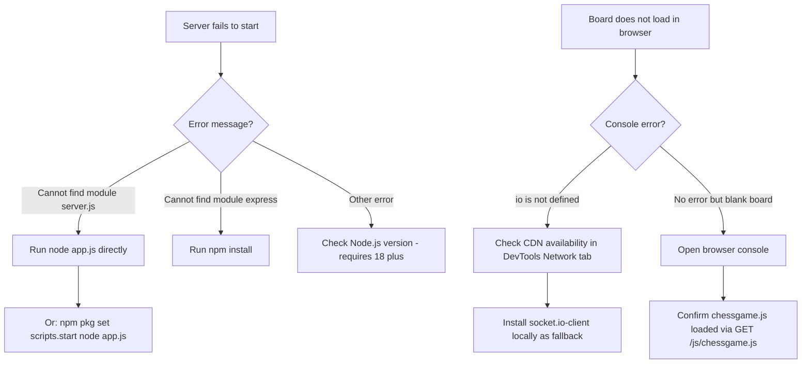

<div align="center">

# ♟️ ChessKnight

>*"Real-time multiplayer chess — validated on the server, synced to everyone in the room."*

<br/>


<br/>
<br/>

**[🚀 Get Started](#-installation) · [✨ Features](#-features) · [🏗️ Architecture](#️-architecture) · [🤝 Contribute](#-contributing)**

</div>


---

## ⚙️ Why I Built This

This project started as a way to understand real-time communication beyond chat applications. I wanted to learn how multiplayer systems keep multiple users synchronized while preventing invalid actions.

Building ChessKnight gave me hands-on experience with WebSockets, Socket.IO, server-side game validation, and managing shared application state in real time. 

Keeping the codebase intentionally small also made it much easier to understand how everything fits together.

---

## ✨ Features

| Feature | Description |
|---|---|
| 🔄 Real-time sync | Every move is instantly broadcast to all connected clients via Socket.io |
| 🛡️ Server-side validation | `chess.js` on the server validates moves before they're accepted |
| 🎭 Automatic role assignment | First two connections become White and Black; everyone else is a spectator |
| 🖱️ Drag-and-drop UI | Intuitive piece movement with no extra libraries |
| 📡 FEN synchronization | Full board state sent as FEN strings — no client drift ever |
| 🪶 Minimal server | Single `app.js` file — easy to read, fork, and extend |

---

## 🏗️ Architecture



---

## 🛠️ Tech Stack

| Layer | Technology |
|---|---|
| Runtime | Node.js |
| Web framework | Express |
| Real-time transport | Socket.io 4.8.1 |
| Game rules & validation | chess.js 0.10.3 |
| Templating | EJS |
| Client logic | Vanilla JavaScript |
| Styling | Tailwind CSS (CDN) |


---

## 🔄 How It Works



---

## 📸 Screenshots


---


## 🚀 Installation

1. **Clone the repository**
   ```bash
   git clone https://github.com/<your-username>/chess-prj.git
   cd chess-prj
   ```

2. **Install dependencies**
   ```bash
   npm install
   ```

3. **Start the server**
   ```bash
   node app.js
   ```
   > ⚠️ The shipped `package.json` points `npm start` at `server.js` (which doesn't exist). Use `node app.js` directly, or fix it first:
   > ```bash
   > npm pkg set scripts.start "node app.js"
   > npm start
   > ```

4. **Open in your browser**
   ```
   http://localhost:3000
   ```
   Open a second tab or share the URL — the first two visitors become White and Black.

---

## 📁 Project Structure

```
chess-prj/
├── app.js               # Express + Socket.io server (roles, validation, broadcast)
├── package.json         # Dependencies and scripts
├── package-lock.json    # npm lockfile
├── views/
│   └── index.ejs        # Main HTML view — loads CDN scripts and client JS
└── public/
    ├── js/
    │   └── chessgame.js # Client logic: socket, renderBoard(), handleMove()
    └── css/             # Static CSS folder
```

---

## 📡 API Reference

### `GET /`
Renders the main page and serves the client application.

**Response:** HTML page with chessboard UI, Socket.io client, and chess.js loaded from CDN.

---

### Socket.io Events

**Client → Server: `move`**
```json
{
  "from": "e2",
  "to": "e4",
  "promotion": "q"
}
```

**Server → All clients: `move`** *(on valid move)*
```json
{
  "from": "e2",
  "to": "e4",
  "promotion": "q"
}
```

**Server → All clients: `boardState`** *(on valid move)*
```
"rnbqkbnr/pppppppp/8/8/4P3/8/PPPP1PPP/RNBQKBNR b KQkq e3 0 1"
```

**Server → Connecting client: `playerRole`**
```
"w"   // or "b"
```

**Server → Connecting client: `spectatorRole`**
```
(no payload)
```

**Server → Sender only: `Invalid move`**
```json
{
  "from": "e2",
  "to": "e9",
  "promotion": "q"
}
```

---

## 🐛 Troubleshooting



<details>
<summary>❌ <strong>Cannot find module 'server.js'</strong></summary>

The `package.json` `start` script references `server.js`, which doesn't exist in the repo.

```bash
# Option 1 — run directly
node app.js

# Option 2 — fix the start script permanently
npm pkg set scripts.start "node app.js"
npm start
```
</details>

<details>
<summary>❌ <strong>Cannot find module 'express'</strong></summary>

Dependencies haven't been installed yet.

```bash
npm install
```
</details>

<details>
<summary>❌ <strong>Uncaught ReferenceError: io is not defined</strong></summary>

The Socket.io client CDN failed to load (network issue or CDN outage).

```bash
# Install locally
npm install socket.io-client

# Then in views/index.ejs, replace the CDN line with:
# <script src="/js/socket.io.min.js"></script>
# and copy the file from node_modules to public/js/
```
</details>

---

## 🗺️ Roadmap

- [ ] Fix `package.json` start script — point it at `app.js`
- [ ] Add named game rooms so multiple independent games can run concurrently
- [ ] Persist game state to a database to survive server restarts
- [ ] Add player names, move timers, and a move history panel
- [ ] Graceful disconnect handling and role re-assignment on reconnect
- [ ] Unit and integration tests for server move validation

---

## 🤝 Contributing

```bash
# 1. Fork the repo and clone your fork
git clone https://github.com/<your-username>/chess-prj.git
cd chess-prj

# 2. Create a feature branch
git checkout -b feat/short-description

# 3. Make focused commits
git add .
git commit -m "feat: add lobby support"

# 4. Keep your branch current
git fetch upstream
git rebase upstream/main

# 5. Push and open a Pull Request
git push origin feat/short-description
```

Please keep PRs focused — one feature or fix per PR makes review faster and merges cleaner.

---

## 📄 License & Contact

**License:** ISC

No author is listed in `package.json`. To reach the maintainer, open an issue on GitHub.

---

<div align="center">

[⬆️ Back to top](#️-chessKnight)